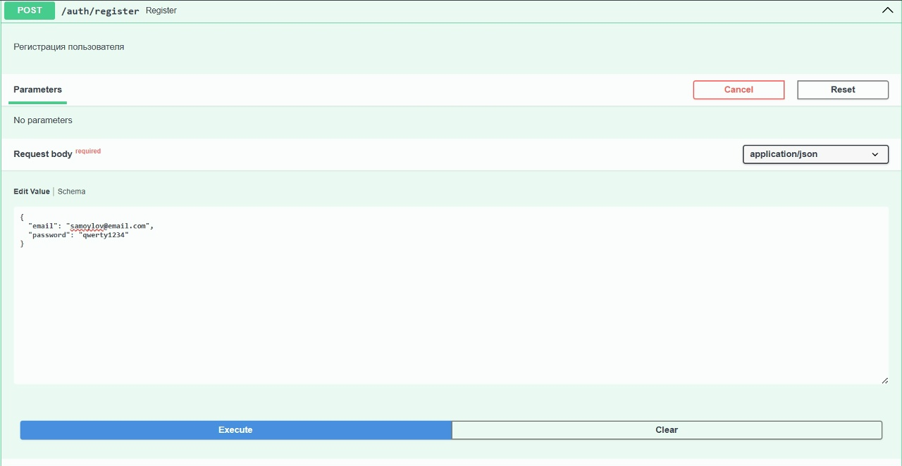
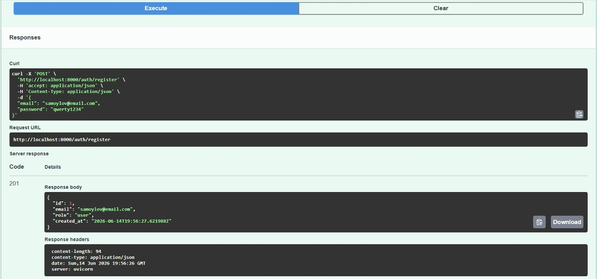
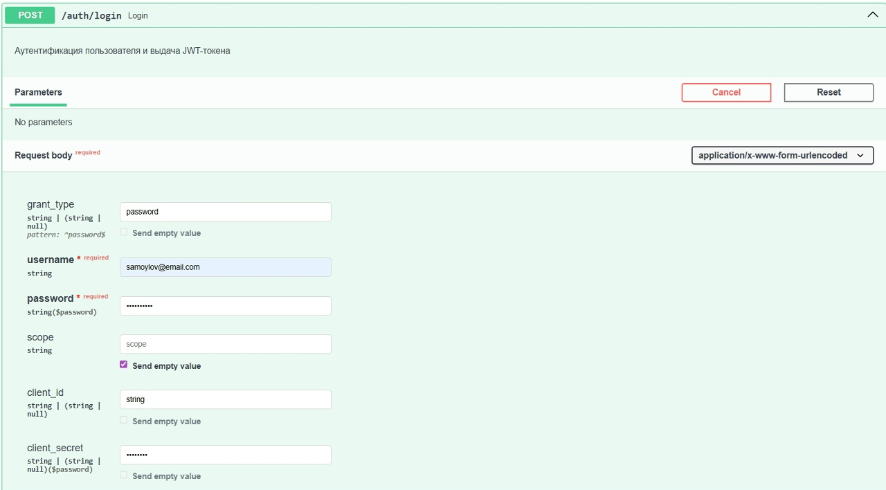
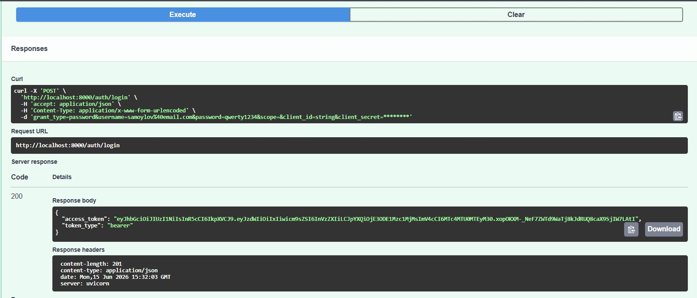
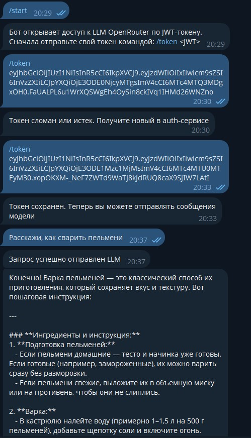
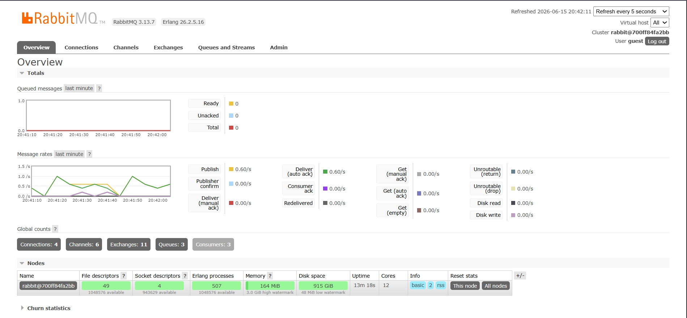
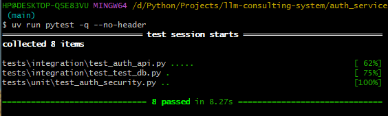
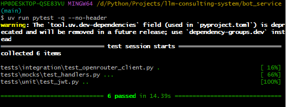

# Двухсервисная система LLM-консультаций

Проект состоит из двух независимых сервисов:

- auth сервис отвечает за аутентификацию и выпуск токенов
- bot-сервис отвечает за предоставление функциональности LLM-консультаций через Telegram-бота

Ключевая идея в том, что  Telegram-бот ничего не знает о пользователях, паролях и механизмах регистрации. Он доверяет 
только корректно подписанному и неистекшему JWT-токену.
___
## Архитектура

Система построена как двухсервисная распределённая архитектура с явным разделением ответственности и асинхронной обработкой LLM-запросов.

---

## 1. Общая схема взаимодействия


```
Telegram User
↓
Bot Service (aiogram)
↓ (JWT validation + Redis session)
RabbitMQ (queue)
↓
Celery Worker
↓
OpenRouter API (LLM)
↓
Celery Worker
↓
Redis (state/result cache, optional)
↓
Bot Service
↓
Telegram User
```
### Компоненты:
- RabbitMQ — брокер задач
- Celery worker — исполнение задач
- OpenRouter — генерация ответа
- Redis — кэш / состояние

### Поток:
1. Bot Service создаёт task `llm_request`
2. RabbitMQ кладёт задачу в очередь
3. Celery worker забирает задачу
4. Делает HTTP запрос в OpenRouter
5. Формирует ответ
6. Отправляет пользователю (или пишет в Redis + Bot читает)

---

## 2. Сервис Auth Service (FastAPI)

Это **единственный источник истины по пользователям и токенам**.

- Регистрация пользователей
- Аутентификация (login)
- Выпуск JWT токенов
- Проверка `/auth/me`

### Основные компоненты:

- `core/security.py` — хэширование паролей + создание/проверка JWT
- `db/models.py` — Пользователь (id, email, password_hash, role)
- `repositories/` — работа с БД без бизнес-логики
- `usecases/auth.py` — регистрация, логин, me
- `api/routes_auth.py` — HTTP конечные точки
- `api/deps.py` — сессия БД + зависимость JWT

### API:
- `POST /auth/register`
- `POST /auth/login`
- `GET /auth/me`

---

## 3. Сервис Bot Service (aiogram + Celery)
Bot Service — это Telegram бот, связывающийся с OpenRouter.

- Приём сообщений Telegram
- Проверка JWT (без обращения к Auth Service)
- Управление пользовательскими сессиями (Redis)
- Диспетчеризация LLM-запросов в очередь
- Отправка результата пользователю

### Основные компоненты:

- `bot/handlers.py` — Telegram логика
- `core/jwt.py` — локальная валидация JWT (HS256/RS256)
- `infra/redis.py` — хранение токенов и state
- `infra/celery_app.py` — конфигурация очереди
- `tasks/llm_tasks.py` — выполнение LLM-запросов
- `services/openrouter_client.py` — HTTP клиент LLM

---

## Установка и запуск
### 1 Клонирование репозитория
```cmd
git clone https://github.com/IlyaSamoylov/llm-consulting-system
cd llm-consulting-system
```

### 2 Переменные среды

#### Скопируйте .env.example в .env в каждом из сервисов 

##### Linux
```cmd
cp .env.example .env
```

##### Windows
```cmd
Copy-Item .env.example .env
```

#### Заполните .env:

- Сгенерируйте свой API ключ на [платформе OpenRouter](https://openrouter.ai/) и установите в `OPENROUTER_API_KEY`
- Ссылку на бесплатную модель можно взять [здесь](https://openrouter.ai/models?fmt=cards&max_price=0&order=newest&output_modalities=text)
либо вставьте `openrouter/free` OpenRouter автоматически подберет бесплатную модель
- заполнить `OPENROUTER_MODEL`
- сгенерировать jwt секрет можно с помощью python кода:
```python
import secrets, base64
print(base64.urlsafe_b64encode(secrets.token_bytes(32)).decode())
```
- создать бота и получить `BOT_TOKEN` можно у бота @BotFather

### 3 Запуск
```cmd
docker compose up --build -d 
```

после этого интерактивная документация будет доступна по ссылкам:

- Swagger auth-сервиса: http://localhost:8000/docs или http://127.0.0.1:8000/docs
- Swagger bot-сервиса: http://localhost:8001/docs или http://127.0.0.1:8001/docs
- RabbitMQ (логин/пароль: guest): http://localhost:15672 

## Сценарий
1. В Swagger auth-сервиса эндпойнт `/auth/register` задать пользователь и пароль
2. `/auth/login` - заполнить `username` и `password` и получить токен
3. В телеграм бот отправить токен: `/token <token>`
4. Отправить интересующий вопрос

## Демонстрация

### Регистрация




### Авторизация




### Бот

### RabbitMQ


### Тесты


